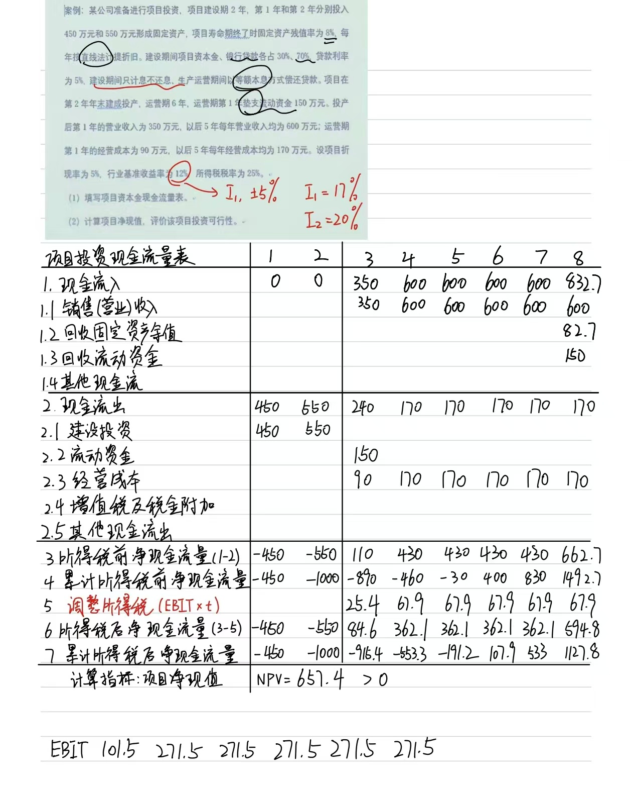

## 案例

某公司准备进行项目投资，项目建设期 2 年，第 1 年和第 2 年分别投入 450 万元和 550 万元形成固定资产，项目寿命期终了时固定资产残值率为 8%，每 年按直线法计提折旧。建设期间项目资本金、银行贷款各占 30%、70%，贷款利率 为 5%，建设期间只计息不还息，生产运营期间以等额本息方式偿还贷款。项目在 第 2 年年末建成投产，运营期 6 年，运营期第 1 年垫支流动资金 150 万元。投产 后第 1 年的营业收入为 350 万元，以后 5 年每年营业收入均为 600 万元；运营期 第 1 年的经营成本为 90 万元，以后 5 年每年经营成本均为 170 万元。设项目折 现率为 5%，行业基准收益率为 12%，所得税税率为 25%。

 (1) 填写项目资本金现金流量表。

 (2) 计算项目净现值，评价该项目投资可行性。

## 步骤

首先，在编制整个表前，我们需要明确一些信息

| 信息         | 值       |
| ------------ | -------- |
| 银行贷款占比 | 70%      |
| 贷款利率     | 5%       |
| 还款方式     | 等额本息 |
| 建设期长度   | 2年      |
| 运营期长度   | 6年      |
| 项目折现率   | 5%       |
| 基准收益率   | 12%      |
| 所得税率     | 25%      |

我们可以首先编制一个借款还本付息表，这个表长这样

| 借款还本付息表 |              | 解释                                                         |
| -------------- | ------------ | ------------------------------------------------------------ |
| 1              | 借款         | 总览项目，空着即可                                           |
| 1.1            | 年初本息余额 | 当年年初本息余额=上一年年末本息余额                          |
| 1.2            | 本年借款     | 通常可以从题目中看出来                                       |
| 1.3            | 本年应计利息 | 对于本课程，**所有的**$$本年应计利息=(年初本息余额+\dfrac{本年借款}{2})*借款利率$$ |
| 1.4            | 本年还本付息 | 在等额本息还款中，该项使用excel的PMT公式进行计算             |
|                | 其中：还本   | 在等额本息还款中，该项使用excel的PPMT公式进行计算            |
|                | 付息         | 在等额本息还款中，该项使用excel的IPMT公式进行计算            |
| 1.5            | 年末本息余额 | $$年末本息余额=年初本息余额+本年借款+本年应计利息-本年还本付息$$ |

### 啥是等额本息等额本金啊？

#### 等额本息

在偿还期内，每年偿还的数额都相同的

- 输入：总借款额，年利率（需要调整为期间利率），还款年数（需要调整为还款期数），还款频率
- 操作：PV = Total amount, FV = 0, I/Y = period rate, N = number of periods.

Example 1.经典房贷

- 贷款数额：100万
- 年利率：3.6%
- 年数：30年
- 还款频率：月付

输入：PV = 1,000,000	FV = 0	I/Y = 0.3	N=360

输出：PMT = **-4546.45**

##### 如何计算偿还的数额中，有多少是利息？

$$利息=未偿还本金数\times 期间利率$$

$$第一期利息=1,000,000\times \frac{3.6\%}{12} = 3000$$

$$第一期偿还本金 = PMT - 第一期利息 = 4546.45-3000=1546.45$$

$$第一期结束后，未偿还的本金=1,000,000-1546.45=998,453.55$$

$$第二期利率=第一期结束后未偿还本金\times期间利率=2,995.36$$

**实际利率法**

#### 等额本金

直接他妈的用$本金/期数$得到每个月应还的本金是多少

$1,000,000/360\approx2777.78$

利息也是用实际利率法

$第一期利息=1,000,000\times 0.3\% =3000$

$第一期总还款=第一期还本金+第一期还利息=5777.78$

$第二期利息=(1,000,000-2777.78)\times0.3\%=2991.67$

#### 总结一下

在等额本息，先算总还款额

在等额本金，先算本金

无论什么情况，利息都是用实际利率法

**如果他妈的运营期没有借款了，那你算出来的本年应计利息与本年偿还的利息必须是一样的，因为那个本年应计利息在他妈没有借款的时候就是实际利率法**

### 资本金现金流量表

| **编号** | **科目名称**     | 解释                                                         |
| -------- | ---------------- | ------------------------------------------------------------ |
| **1**    | **现金流入**     | =小项和                                                      |
| 1.1      | 营业收入         | 题目给的                                                     |
| 1.2      | 回收固定资产余值 | $=固定资产原值\times残值率$（只在最后一期回收）              |
| 1.3      | 回收流动资金     | 题目会给                                                     |
| 1.4      | 其他现金流入     | 0                                                            |
| **2**    | **现金流出**     | =小项和                                                      |
| 2.1      | 项目资本金       | =建设期项目年投资额                                          |
| 2.2      | 借款本金偿还     |                                                              |
| 2.3      | 借款利息偿还     |                                                              |
| 2.4      | 流动资金         | 一开始垫付的，会在期末回收流动资金                           |
| 2.5      | 经营成本         | 题目会给                                                     |
| 2.6      | 销售税金及附加   | 一般是0                                                      |
| 2.7      | 所得税           | $=(营业收入-经营成本-利息支出-固定资产折旧-销售税金及附加)\times所得税税率$ |
| 2.8      | 其他现金流出     | 一般是0                                                      |
| **3**    | **净现金流量**   | $=\textbf{现金流入}-\textbf{现金流出}$                       |

**用净现金流量参与NPV,IRR的计算**

### 投资现金流量表

| 投资现金流量表 | 项目               | 解释                                                 |
| -------------- | ------------------ | ---------------------------------------------------- |
| 1              | 现金流入           | =小项和                                              |
| 1.1            | 营业收入           | 与资本金现金流量表同源                               |
| 1.2            | 回收固定资产余值   | 与资本金现金流量表同源                               |
| 1.3            | 回收流动资金       | 与资本金现金流量表同源                               |
| 2              | 现金流出           | =小项和                                              |
| 2.1            | 建设投资           | 建设投资在建设期全投入，运营期无投入                 |
| 2.2            | 流动资金           | 通常来讲，在运营期第一期投入，在最后一期收回         |
| 2.3            | 经营成本           | 题目会给                                             |
| 2.4            | 调整所得税         | $=(营业收入-经营成本-固定资产折旧)\times 所得税税率$ |
| 3              | 所得税后净现金流量 | $=\textbf{现金流入}-\textbf{现金流出}$               |

