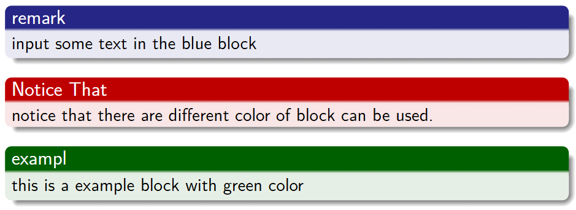

## LaTeX的下载与安装

https://blog.csdn.net/Nicolecocol/article/details/136968456

或者使用线上overleaf.com这个网站里有很多现成的模板

https://latex.lierhua.top/zh/这是一个对于LaTeX的介绍的文档，非常全面，包括了数学符号备查表的部分

# Beamer

### 一个基本的beamer需要的部分

记得设置编译器为**XeLaTeX**

首先在代码的最开始部分，要对整个文档进行一些设置，我们称之为导言区

```latex
\documentclass[UTF8]{beamer}%声明这个文件是一个beamer的tex类,使用UTF8进行编码
\usepackage[UTF8,noindent]{ctexcap}%支持中文输入的包，noindent取消首行缩进
\usepackage{graphicx} %use graph format这个包是用来插入图片的
\usepackage{subfigure}
\usepackage{bm}%加粗字体，这个\bm是用来加粗数学表达式的，加粗文本的命令使用\textbf{~}
\usepackage{calligra}%一种书法风格的字体,通常在最后的thanks for listening使用
\usetheme{Madrid}%选定你要设置的beamer的风格，这里可选项非常多
\usefonttheme{serif}%设置字体
%下面这三行就是储存作者及信息等，这里这种设置的原因追求了美观
\title[Zhang Xurui]{On-Demand Service Platforms}
\subtitle{Structure lead to complexity?}
\author[CUFE]{Zhang Xurui}
\date{November 29, 2024}
%以下代码用于在每个section前添加一个目录展示来高亮当下的section
\AtBeginSection[]
{
	\begin{frame}
		\frametitle{Catalogue}
		\tableofcontents[currentsection]
	\end{frame}
}
%你可能看到这部分有缩进，但是latex真的需要缩进吗？答案是不用，只不过我单纯觉得缩进好看罢了
```

以上是每个beamer类都可以通用的部分，直接Ctrlcv在一个新的beamer中即可

下面声明，我要开始写这个ppt的内容了

```latex
\begin{document}%当然，在整个代码的最后，也要有一个\end{document}
%添加一个标题页，必须有这一页
\frame{\titlepage}
%添加目录页
\begin{frame}
	\frametitle{Catalogue}
	\tableofcontents
\end{frame}
%下面开始第一部分，是一个实际的演示。我一般将这部分定义为Background, Assumptions and Notation, 这也是一个成熟的学术汇报一上来就应该拥有的部分，像文献综述，一些假设，背景，以及用到的符号，都会在这个部分提前说明。
\section{Background, Assumptions and Notation}
%这里声明了一个section后，自动就在catalogue页面出现了
\begin{frame}
		\frametitle{Background}
		We firstly show some Backgrounds.%这一行的内容会直接出现在PPT上
		\begin{itemize}
			\item Ride-hailing platforms
			\item Far from the pickup point incur cancellation
			\item Maintain the cancellation rate at a low level
			\item The platforms conduct matching periodically
			\item P Model. Minimum-cost flow problem
			\item Data-driven approach
		\end{itemize}
\end{frame}
```

你可能察觉到了这种结构的存在

```latex
\begin{frame}
	\frametitle{~}
	Text you want to display~
\end{frame}
```

这种结构我称其为一个单元，你可以简单的把他理解成是一页PPT，但有可能不是一页pdf（通过pause控制出现的动画，实际上生成了两页pdf）通过以上的结构，你就生成了一页ppt，标题是~，ppt上的内容是Text you want to display~。
在这里说明一下，由于beamer是用于展示的，因此其主要内容采取的是在上下的中间的形式，也就是说一行简单的文本是从左边对齐，直接出现在当前展示页的中间的。

```latex
\end{document}
```

这样，你就创建好了一个基本的展示。

### 强调，列表的应用

- Ride-hailing platforms

如何实现上述的形式呢？

```LATEX 
\begin{itemize}
	\item Ride-hailing platforms
\end{itemize}
```

这样就可以，这种表述是非常常见的，如果需要引入带有编号的列表，只需将上述的itemize改为enumerate即可。

### block，盒子的应用



这就是一个简单的盒子block，对应的代码是这样的

```latex 
\begin{block}{remark}
input some text in the blue block
\end{block}
%一个简单的蓝色Block    
\begin{alertblock}{Notice That}
notice that there are different color of block can be used.
\end{alertblock}
%一个alertblock，红色的
\begin{exampleblock}{exampl}
this is a example block with green color
\end{exampleblock}
%绿色的block
```

### 中心对齐环境

什么是环境？一个\begin\end就表示了一个环境，在单纯的字体输入阶段，加入大括号`{text in another environment}`就表明了这段大括号内的字体是另一个环境，在大括号前加入一些指令，如`\textsc{text in another environment}`，或者在`{\tiny text in another environment}`这样就保证了\tiny指令只对大括号内的文字生效

如何引入中心对齐环境？有两种方式，一种方式是直接使用命令\centering

```latex 
\begin{frame}
	\frametitle{~}
	\centering
	Text you want to display~
	Text you want to display too!
\end{frame}
```

这样两行文本都是中心对齐的，这个环境在遇到下一个\end{}之前不会结束，如果只需要中心对齐第一行文本，第二行文本继续使用左端对齐，只需要对代码做以下改动

```latex 
\begin{frame}
	\frametitle{~}
	\centering
	Text you want to display~
	\raggedright%这个代码用于引入左对齐环境
	Text you want to display too!
\end{frame}
```

也可以采用以下的\begin\end环境引入中心对齐环境

```latex
\begin{center}
	Text you want to display~
\end{center}
```

### 如何插入一张图片

```latex
\begin{frame}
	\centering
	\includegraphics[width=\linewidth]{images/SG1}
\end{frame}
```

其中，`[width = \linewidth]`自动调整图片适应宽度`images/SG1`指示了在当前工作环境文件夹内images文件夹内名称为SG1的图片

### column环境，分栏

如果一页PPT内需要展示两列的内容，或者左边是图片，右边是对图片的说明。

```latex
\begin{frame}		
	\frametitle{Two-column slide}
	\begin{columns}%开始columns环境
		\column{0.5\textwidth}%设置第一个column的宽度，为0.5倍的整体宽度
		%直至第二个\column指令出现前，以下的内容都包括在第一个column中
		This is a text in first column.
		$$E=mc^2$$
		\begin{itemize}
			\item First item
			\item Second item
		\end{itemize}
			
		\column{0.5\textwidth}
		This text will be in the second column
		and on a second thoughts, this is a nice looking
		layout in some cases.
	\end{columns}
\end{frame}
```

### 字体设置，字体大小

Beamer默认的字体大小是10pt，也就是说，在引言部分，以下两个命令的效果是一样的

```latex
\documentclass[UTF8,10pt]{beamer}%将10pt更改为其他数字，即可调整全局默认的字体大小
\documentclass[UTF8]{beamer}
```

latex提供了一些默认调整字体大小的命令

|     声明      | 对应字号 |
| :-----------: | :------: |
|     \tiny     |   5pt    |
|  \scriptsize  |   7pt    |
| \footnotesize |   8pt    |
|    \small     |   9pt    |
|  \normalsize  |   10pt   |
|    \large     |   12pt   |

只需在环境开始时声明，其有效范围一直到当前环境的结束，或者手动切换到默认字号（再声明一次）。一般需要调字号的情况都是公式长度问题


# 数学公式的具体实现

首先要引入一个非常强大的高级数学公式包

```latex
\usepackage{amsmath}
```

如何引入公式环境，只需要一个符号$

```latex
$This is in line equation$
$$This is a single line of equation, with automatic centering$$
```

或者继续使用\begin\end环境

```latex
\begin{equation}
a = b + c%这种环境是引入了编号环境，公式会进行编号
\end{equation}

$$ a = b + c \tag{1.1}$$%直接在一个公式环境内\tag{行标}也可以给公式编号
```

公式内实现中文

```latex
$\text{Chinese characters}$
```


