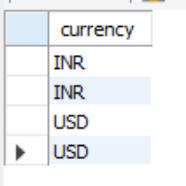
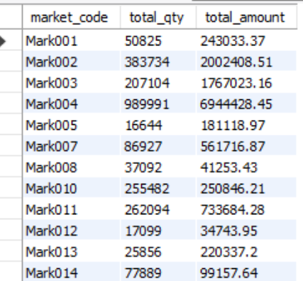
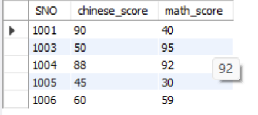
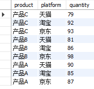
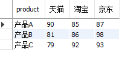
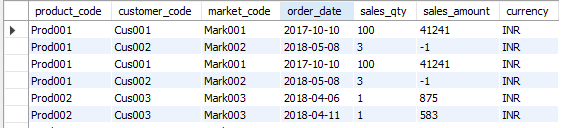

# MYSQL

## MySQL BASIC GRAMMAR

quick sheet

```sql
SELECT    -- 1. 你想要哪几列？ (What)
FROM      -- 2. 数据在哪个表里？ (Where)
WHERE     -- 3. 过滤条件是什么？ (Filter)
GROUP BY  -- 4. 怎么分组/分类？ (Aggregation)
HAVING    -- 5. 分组后还要再过滤吗？ (Filter after Aggregation)
ORDER BY  -- 6. 结果怎么排序？ (Sort)
LIMIT	  -- 7. 只想查看一些结果而不是全部的
```

How it works?

### SELECT

```sql
select *
select column1, column2
select table.column #select from anothe table, column
select distinct #remove duplicate rows
```

also, there are some aggregateFunction can be used when you want to get some 'aggregated data'

due to the order of introduction, we don't use conditions in this chapter

``` sql
#for example, if you have a table named sales, and you want to calculate the total salesrev in this table
select sum(salesrev) from sales;
#if you want to calculate the average salerev similarly
select avg(salesrev) from sales;
#NOTICE: IF NO CONDITION USED, SUCH METHOD IS CALCULATING A STATISTICAL VALUE OF SPECIFIC COLUMN
min()
max()
```

the aggregate function will reveal its charm in the following chapter

### FROM 

```sql
from tablename
from tablename as alias # assign another name for convenience, as can be omit
select m.name m.level from members m;
```

From, also can be used to join two table 

```sql
select m.name, o.amount
from members m
left join orders o
on m.id = o.member_id;
#on <condition_of_join>
```

**left join**, append the right table to the left table, all the left table is remained in the action, and the condition of join is important of the action.

### WHERE

WHERE is the first filter in your selection, similarly as Excel, it dropout the row which do not satisfied the condition

```sql
select * from transactions where sales_amount > 1000;
#find the orders that sales amount larger than 1000
select * from transactions where market_code != 'mark001';
#find the market code NOT mark001
```

**between and**

```sql
-- 找出 2020 年全年的订单
-- 等同于：order_date >= '2020-01-01' AND order_date <= '2020-12-31'
SELECT * FROM transactions WHERE order_date BETWEEN '2020-01-01' AND '2020-12-31';
```

```sql
-- 只要 巴黎、伦敦、纽约 这三个城市的单子
SELECT * FROM transactions WHERE market_code IN ('Paris', 'London', 'New York');
```

**pattern matching**

%	represents any number of characters (0 or countless). 
_	  represents any single character.

```sql
-- 找出所有姓 "张" 的客户 (ZhangSan, ZhangWei...)
SELECT * FROM customers WHERE cust_name LIKE 'Zhang%';

-- 找出名字里包含 "Tech" 的公司 (HighTech, TechSoft...)
SELECT * FROM customers WHERE cust_name LIKE '%Tech%';
```

NOTICE: WHEN YOU SELECT SOME PATTERN, MUST USE **`LIKE`** INSTEAD OF `'='`

**is null selection**

```sql
-- 找出还没有填写区域(zone)的记录
-- 错误写法：WHERE zone = NULL (这是错的！)
-- 正确写法：
SELECT * FROM markets WHERE zone IS NULL;
```

**AND OR NOT**

```sql
-- 既要是2020年，又要金额大于500
WHERE year = 2020 AND sales_amount > 500

-- 要么是巴黎的单子，要么金额特别大
WHERE market_code = 'Paris' OR sales_amount > 100000

-- 不要巴黎的单子
WHERE NOT market_code = 'Paris'
```

**difference between where and having**

where deals with raw data, having deals with aggregated data

### GROUP BY

function as Pivot Table in excel

```sql
SELECT
    分组列,              -- 1. 你按什么分的组？
    聚合函数(统计列)      -- 2. 分组后你要算什么？
FROM 表名
WHERE 过滤条件           -- (可选) 分组前先筛掉脏数据
GROUP BY 分组列;         -- 3. 告诉数据库按这一列合并
#a simple count of rows group by type
select customer_type, count(*) from customers group by customer_type;

#multi-group, aggregate the sales_qty
select product_code, customer_code, sum(sales_qty) from transactions group by product_code, customer_code;
```

NOTICE

```sql
-- 错误！数据库会懵：一班有张三和王五两个人，你让我显示"name"，我到底显示谁的名字？
SELECT class, name, AVG(score)
FROM students
GROUP BY class;

#CORRECT CODE
-- 要么把 name 去掉
SELECT class, AVG(score) FROM students GROUP BY class;

-- 要么把 name 也加入分组（那就是按“班级+姓名”统计）
SELECT class, name, AVG(score) FROM students GROUP BY class, name;
```

### HAVING

HAVING must follow GROUP BY and precede ORDER BY

```sql
SELECT
    分组列,
    聚合函数(统计列)
FROM 表名
WHERE 原始数据过滤条件      -- 第一关：筛掉不合格的行
GROUP BY 分组列             -- 第二关：打包分组
HAVING 聚合函数(统计列) 条件 -- 第三关：筛掉不合格的组
ORDER BY ...;
```

HAVING is a filter based on statistical values

```sql
-- 老板想知道哪些客户的累计购买金额 超过了 100,000？
# 识别统计量：累计购买金额
sum(sales_amount) > 100000
# 识别调出列
select customer_code, sum(sales_amount) as total_amount from transactions group by customer_code having sum(sales_amount) > 100000
```

```sql
select product_code, count(*) as number_of_transaction from transactions group by product_code having count(*) < 3;
-- 老板想找出哪些产品 (product_code) 的交易记录次数少于 2 次（可能是冷门产品，或者数据录入太少）。
```

```sql
select market_code, sum(sales_qty) as total_qty from transactions where order_date like '2018%' group by market_code having sum(sales_qty) > 500;
-- 老板只想看 2018年 (order_date 是 2018) 的数据中，哪些市场 (market_code) 的总销量 (sales_qty) 超过了 500？
```

| **特性**             | **WHERE**                                                | **HAVING**                                                   |
| -------------------- | -------------------------------------------------------- | ------------------------------------------------------------ |
| **操作对象**         | **每一行原始数据**                                       | **打包后的“组”**                                             |
| **例子**             | `WHERE sales_amount > 100`   (筛出金额大于100的单笔交易) | `HAVING SUM(sales_amount) > 100`   (筛出总金额大于100的客户/市场) |
| **能否用 SUM/COUNT** | **绝对不能**                                             | **必须配合使用** (通常)                                      |
| **执行时机**         | 分组之前 (Before Grouping)                               | 分组之后 (After Grouping)                                    |

As long as your filtering conditions include words like "in total", "average", or "how many times in total", must use HAVING.

### ORDER BY 

```sql
SELECT 列名
FROM 表名
... (WHERE / GROUP BY / HAVING)
ORDER BY 排序列名 [ASC | DESC];
# Ascending
# Descending
```

usage

```sql
select * from transactions order by sales_amount desc limit 5;
# only show 5 outcomes
```

multi order

 first sort the orders by "market_code"; if the markets are the same, then sort them by "sales_amount" from highest to lowest.

```sql
select * from transactions order by market_code desc, sales_amount desc;
```

the 6 highest sales_amount of the region?

```sql
select market_code, sum(sales_amount) as total_sales
from transact ions
group by market_code
order by total_sales desc
limit 6;
```

## MYSQL ADVANCED GRAMMAR

### RANK

`RANK()` is used to assign a ranking (starting from 1) to each row in the query result, and it also handles "ties": 

- **Equal scores (parallel ranking) result in the same ranking position**
- **Ranking numbers jump (with gaps)**: For example, if two people tie for 2nd place, then the next one would be 4th place.
This is the most distinctive feature of `RANK()`: **with gaps** (gaps).

```sql
RANK() OVER (
  [PARTITION BY 分组列1, 分组列2, ...]
  ORDER BY 排序列1 [ASC|DESC], 排序列2 ...
)

-- NOTICE: rank() generated a new column in the table
```

**PARTITION BY** which is a group, and rank them in this group

e.g., according to user_id, rank the sales_mount

```sql
select *,
rank() over(
	partition by customer_code
    order by sales_amount desc
) as rk
from transactions;
```

but, if you want to get the largest order of one customer, you can 

```sql
select *
from(
	select *,
	row_number() over(
		partition by customer_code
    	order by sales_amount desc
	) as rk
	from transactions
) t -- NOTICE ALIAS MUST BE ASIGNED
where rk = 1;
```


For example, you want to select the full table of transaction, and ranked by the sales_amount

```sql
select *,
rank() over(order by sales_amount desc) as rk
from transactions;
```

| 需求                           | 用哪个         | 原因          |
| ------------------------------ | -------------- | ------------- |
| 比赛名次 / 排行榜（允许空档）  | `RANK()`       | 并列 → 跳号   |
| 分层 / 等级 / 档位（不想跳号） | `DENSE_RANK()` | 并列 → 不跳号 |
| 每行唯一 / 最新一条 / Top1     | `ROW_NUMBER()` | 不允许并列    |

### WITH

`with` generate a temporary table for complicated calculation, for example, the origin data of transaction is dirt, the number of the sales_amount might be negative or we want to seperate different currencies in the table, we can use

```sql
with clean_transactions as (
	select *
    from transactions
    where sales_amount >= 0
)
select count(*)
from clean_transactions;
# logic: do a new table first, then execute following code
```

or difference currencies

1. first, we want to see how many categories in currency the table contained?

```sql
select distinct currency from transactions;
```

return



by inquiry, the duplicated value contained a 换行符(LF, line feed)

we can use `WHERE currency LIKE '%USD%'` to match this pattern

---

场景设定：老板的需求

假设老板让你算出：**所有“高价值市场”的总销售额，以USD计价**

规则 1 (清洗)： 必须剔除 sales_amount 小于等于 0 的错误数据（比如图中第 2 行）。

规则 2 (筛选)： “高价值市场”定义为总销量 (sales_qty) 超过 100 的市场market_code

规则3（数据转化）：将INR转换为USD，假定利率为75

```SQL
#first, we need create a new table, this table cleaned the dirt data, and transfer the INR to USD
with clean_transactions as (
	select *,
		case
			when currency like '%INR%' then sales_amount / 75
            when currency like '%USD%' then sales_amount
            else 0
            end as amount_in_usd
    from transactions
    where sales_amount > 0
)
select market_code, sum(sales_qty) as total_qty, round(sum(amount_in_usd),2) as total_amount
from clean_transactions
group by market_code
having total_qty > 10000
order by market_code;
```



DOUBLE CHECK, we want to see whether the total_qty in mark006 is less than 10000 or not, write

```sql
select market_code, sum(sales_qty) as total_qty
from transactions
where sales_amount > 0 and market_code like 'Mark006'
group by market_code
;
```

DO NOT FORGET YOU CLEANED THE DATA IN THE PROGRAM, YOU SHOULD USE THE CLEANED DATA IN THE CHECK PHASE`WHERE sales_amount > 0`

### 并表逻辑，自连接与分组聚合

SNO SUBJECT SCORE

1001 语文     90

1001 数学     40

1002 语文     80

请写出这样的一个SQL，查询出语文成绩及格，数学成绩不及格的学生的SNO

**SELF JOIN**

we can use alias point to the same table T


```sql
create table new_t as
select t1.SNO, t1.SCORE as chinese_score, t2.SCORE as math_score
from T t1
join T t2 on t1.SNO = t2.SNO
where t1.SUBJECT = '语文' and t2.SUBJECT = '数学';
select * from new_t;

select SNO
from new_t
where chinese score >= 60 and math_score < 60;
```



OR we give a whole code with out using the new_table

```sql
select t1.SNO
from t t1
join t t2
on t1.SNO = t2.SNO
where t1.SUBJECT = '语文' and t1.SCORE >=60
AND t2.SUBJECT = '数学' and t2.SCORE < 60;
```

### 如果含有缺失值与额外值，如何自连接呢

inner join: if null data is found, the row of the table will be dropped!!

**Anchor & Left join**

back to the example of grade

Anchor: the SNO, we need to traverse

```sql
select distinct SNO from t
```

this is the part of the master table, thus we can

```sql
(select distinct SNO from t) master
```

Left join: we want to ensure two things

1. a SNO in the table master, does he have grade of such a subject, if yes, what is the grade of the SNO in this subject
2. traverse THREE subjects in the table, then you will get a full table 

```sql
left join t chinese
on master.SNO = chinese.SNO and chinese.subject = '语文'

left join t math
on master.SNO = math.SNO and
math.subject = '数学'

left join t english
on master.SNO = english.SNO and
math.subject = '英语'
```

finally, select correspondence column in the final table, NOTICE you can use temporal quote in your code to select them

the complete code of this problem is as follows

```sql
select 
	master.SNO,
	chinese.score as 语文,
    math.score as 数学,
    english.score as 英语
from (select distinct SNO from t) master
left join t chinese
on master.SNO = chinese.SNO and chinese.subject = '语文'

left join t math
on master.SNO = math.SNO and
math.subject = '数学'

left join t english
on master.SNO = english.SNO and
english.subject = '英语'

order by master.SNO;
```

### 行转换与列转换

before you execute the transfer row and column, you need to define the index and the type of the column you want, then you can use all types of `join` to achieve your object.



for example, your boss want to see the different products sales quantity in different platforms, then your row will be products and the column is the platform

**CASE WHEN + AGGREGATE FUNCTION**

```SQL
select product,
	sum(case when platform = '天猫' then quantity else 0 end) as 天猫,
	sum(case when platform = '淘宝' then quantity else 0 end) as 淘宝,
	sum(case when platform = '京东' then quantity else 0 end) as 京东
from rc_example
group by product;
```

the reason of using `sum` instead of take the value simply

**SQL requires the non-groupby column must be aggregated, theoretically, although each of the product+platform only have one row, BUT sql does not know**

column to row



```sql
SELECT product, '天猫' AS platform, 天猫 AS score FROM c2r
UNION ALL
SELECT product, '淘宝' AS platform, 淘宝 AS score FROM c2r
UNION ALL
SELECT product, '京东' AS platform, 京东 AS score FROM c2r
order by product;
```

## The objects MySQL faced

apparently, is excel, dataframe, table, etc.

the variable is a string, represent the dataframe, the table, the column, or the row

## commands in the shell

```sql
net start mysql80 #start the local server
net stop mysql80 #stop the local server
```

## A simple HELLO WORLD

IN mysql, a database should be created before everything

```sql
SHOW DATABASES; #check the databases
CREATE DATABASE test; #create one
USE test; #CHOOSE THE DATABASES
```

the database test, is equivalently to .xlsx, then you can create some table, similar to table in the excel

```sql
CREATE TABLE employees (
    id INT,              -- 整数类型
    name VARCHAR(50),    -- 字符串类型 (最多50个字符)
    dept VARCHAR(20),    -- 部门
    salary INT           -- 薪资
);
```

# TIPS OF COMMAND

```sql
truncate table t; #delete the data in table t but remain the varible t

create table a_new_table as
select * from old_table where id = 1;
#create a table using the query outcome


```


# MySQL workbench


B-binary

UN-unsigned

ZF-zero fill, such as the length is 3 but  the value of the column is 5, the actual value in this cell is 005

AI- auto increment, 1,2,3,...,

G-generated column, which mean that this column is calculated by other columns

**Hint**

the default query of workbench is 1000 rows


# SalesInsights

import database

https://github.com/codebasics/DataAnalysisProjects

open a query shell, first execute

```sql
Use sales;
```

we have a table as



ok, we want to show some advanced usage of sql

**The boss's request: "Don't just show me the total figures. I want to see the specific products that were sold in the top 2 orders in each market (market_code) based on the sales amount."**

---

# SRC

https://github.com/codebasics/DataAnalysisProjects

```SQL
use sales;
show tables;
select * from customers;
select custmer_name from customers;
select distinct custmer_name from customers;

select * from markets;
select * from transactions;

select avg(sales_amount) from transactions;

select customer_code, sales_qty from transactions where sales_qty > 100;
select customer_code, sales_qty from transactions where sales_qty > 100;
select customer_type, count(*) from customers group by customer_type;

select product_code, customer_code, sum(sales_qty) from transactions group by product_code, customer_code;

select customer_code, sum(sales_amount) as total_spent from transactions group by customer_code having sum(sales_amount) > 10000000;

select product_code, count(*) as number_of_transaction from transactions group by product_code having count(*) < 3;

select market_code, sum(sales_qty) as total_amount from transactions where order_date like '2018%' group by market_code having sum(sales_qty) > 500;

select * from transactions order by sales_amount desc limit 5;

select * from transactions order by market_code desc, sales_amount desc;

select count(*) from transactions;

select market_code, sum(sales_amount) as total_sales
from transactions
group by market_code
order by total_sales desc
limit 6;

select *,
rank() over(order by sales_amount desc) as rk
from transactions;

select *,
rank() over(
	partition by customer_code
    order by sales_amount desc
) as rk
from transactions;

select *
from(
	select *,
	row_number() over(
		partition by customer_code
    	order by sales_amount desc
	) as rk
	from transactions
) t
where rk = 1;


select * 
from(
	select *,
	row_number() over(
		partition by market_code
		order by sales_amount desc
	) as rk
	from transactions
) t
where rk <=2;

with clean_transactions as (
	select *
    from transactions
    where sales_amount >= 0
)
select count(*) from clean_transactions;

-- transfer currency 
select * from transactions;
select count(*) from transactions;
select distinct currency from transactions;

select count(*) from transactions where currency like '%USD%';

-- boss' need

with clean_transactions as (
	select *,
		case
			when currency like '%INR%' then sales_amount / 75
            when currency like '%USD%' then sales_amount
            else 0
            end as amount_in_usd
    from transactions
    where sales_amount > 0
)
select market_code, sum(sales_qty) as total_qty, round(sum(amount_in_usd),2) as total_amount
from clean_transactions
group by market_code
having total_qty > 10
order by market_code;

-- double check

select market_code, sum(sales_qty) as total_qty
from transactions
where sales_amount > 0 and market_code like 'Mark006'
group by market_code
;

select market_code, sales_qty, sales_amount
from transactions
where market_code like '%Mark006%';

-- EXAMPLE OF SELF-JOIN
use test;
truncate table t;

-- 2. 批量插入“更有灵魂”的数据
INSERT INTO T (SNO, SUBJECT, SCORE) VALUES 
-- [类型A] 目标客户：语文及格(>=60)，数学不及格(<60)
('1001', '语文', 90),
('1001', '数学', 40),   -- 应该被选中

-- [类型B] 缺考/只有一门课：只有语文，没有数学记录
('1002', '语文', 80),   -- 因为INNER JOIN找不到数学，不应该被选中

-- [类型C] 反向偏科：语文挂科(<60)，数学大神
('1003', '语文', 50),
('1003', '数学', 95),   -- 只有数学及格，不应该被选中

-- [类型D] 学霸：两门都及格
('1004', '语文', 88),
('1004', '数学', 92),   -- 数学也及格了，不应该被选中

-- [类型E] 学渣：两门都挂科
('1005', '语文', 45),
('1005', '数学', 30),   -- 语文也没及格，不应该被选中

-- [类型F] 边缘测试：正好60分 vs 正好59分 (边界值测试)
('1006', '语文', 60),   -- 压线飘过 (>=60 成立)
('1006', '数学', 59),   -- 差一分挂科 (<60 成立) -> 应该被选中

-- [类型G] 乱入的科目：有英语成绩
('1007', '语文', 70),
('1007', '英语', 90);   -- 没有数学成绩，不应该被选中

select * from t;
set sql_safe_updates = 1;
drop table if exists new_t;
create table new_t as
select t1.SNO, t1.SCORE as chinese_score, t2.SCORE as math_score
from T t1
join T t2 on t1.SNO = t2.SNO
where t1.SUBJECT = '语文' and t2.SUBJECT = '数学';
select * from new_t;

select SNO
from new_t
where chinese_score >=60 and math_score < 60;

select t1.SNO
from t t1
join t t2
on t1.SNO = t2.SNO
where t1.SUBJECT = '语文' and t1.SCORE >=60
AND t2.SUBJECT = '数学' and t2.SCORE < 60;
```

