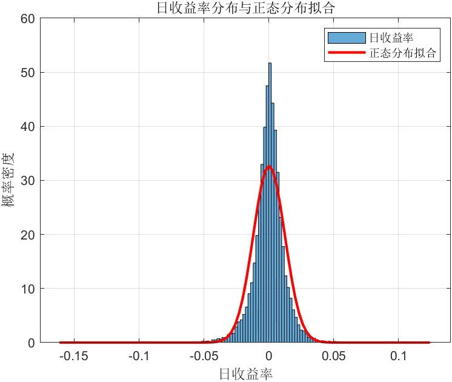

```matlab
filename = 'NIKKEI225.xlsx';
data = readtable(filename,'sheet','Daily, Close');
prices = double(data.NIKKEI225);
num_trading_days_per_year = 252; 
daily_returns = diff(log(prices));
valid_indices = ~isnan(daily_returns) & ~isinf(daily_returns);
returns_cleaned = daily_returns(valid_indices);
num_returns = length(returns_cleaned);
if num_returns == 0
    error('清洗后没有剩余的有效收益率数据。请检查原始价格数据中是否有足够的非缺失值。');
end


mean_daily_return = mean(returns_cleaned);

avg_annual_return = mean_daily_return * num_trading_days_per_year;

std_daily_return = std(returns_cleaned);

annual_volatility = std_daily_return * sqrt(num_trading_days_per_year);

skewness_return = skewness(returns_cleaned);

kurtosis_return = kurtosis(returns_cleaned);
excess_kurtosis_return = kurtosis_return - 3; 

confidence_level = 0.05;

var_5_percent = quantile(returns_cleaned, confidence_level);

var_5_percent_loss = abs(var_5_percent);


fprintf('--- 日经225指数收益率分析结果 ---\n');
fprintf('原始样本期: %s 到 %s\n', ...
char(data.observation_date(1)), char(data.observation_date(end)));
fprintf('清洗后用于分析的有效日收益率数据点: %d 个\n', num_returns);
fprintf('------------------------------------\n');

fprintf('1. 平均年度收益率:                 %.4f  (即 %.2f%%)\n', avg_annual_return, avg_annual_return * 100);
fprintf('2. 日收益率的标准差:                 %.4f\n', std_daily_return);
fprintf('   年化波动率 (供参考):            %.4f  (即 %.2f%%)\n', annual_volatility, annual_volatility * 100);
fprintf('3. 收益率的偏度 (Skewness):        %.4f\n', skewness_return);
fprintf('4. 收益率的峰度 (Kurtosis):        %.4f\n', kurtosis_return);
fprintf('   超额峰度 (供参考):              %.4f\n', excess_kurtosis_return);
fprintf('5. 概率为5%%的在险价值 (VaR 5%%):   %.4f  (即日损失可能不超过 %.2f%%)\n', var_5_percent_loss, var_5_percent_loss * 100);

fprintf('------------------------------------\n');
figure;
histogram(returns_cleaned, 'Normalization', 'pdf');
hold on;
x = linspace(min(returns_cleaned), max(returns_cleaned), 100);
y = normpdf(x, mean_daily_return, std_daily_return);
plot(x, y, 'r', 'LineWidth', 2);
title('日收益率分布与正态分布拟合');
xlabel('日收益率');
ylabel('概率密度');
legend('日收益率', '正态分布拟合');
grid on;
```

计算结果

```text
--- 日经225指数收益率分析结果 ---
原始样本期: 1949-05-16 到 2025-10-24
清洗后用于分析的有效日收益率数据点: 18271 个
------------------------------------
1. 平均年度收益率:                 0.0638  (即 6.38%)
2. 日收益率的标准差:                 0.0122
   年化波动率 (供参考):            0.1939  (即 19.39%)
3. 收益率的偏度 (Skewness):        -0.4590
4. 收益率的峰度 (Kurtosis):        12.9422
   超额峰度 (供参考):              9.9422
5. 概率为5%的在险价值 (VaR 5%):   0.0189  (即日损失可能不超过 1.89%)
------------------------------------
```

figure



| 权重       | 权重        |         |            |          | 2        | 3          | 4           |
| ---------- | ----------- | ------- | ---------- | -------- | -------- | ---------- | ----------- |
| T-BILL     | 标准普尔500 | 收益    | 组合标准差 | 组合方差 | 效用A=2  | 效用A=3    | 效用A=4     |
| 0          | 1           | 0.13    | 0.2        | 0.04     | **0.09** | 0.07       | 0.05        |
| 0.1        | 0.9         | 0.12235 | 0.18       | 0.0324   | 0.08995  | 0.07375    | 0.05755     |
| 0.2        | 0.8         | 0.1147  | 0.16       | 0.0256   | 0.0891   | 0.0763     | 0.0635      |
| 0.3        | 0.7         | 0.10705 | 0.14       | 0.0196   | 0.08745  | 0.07765    | 0.06785     |
| 0.4        | 0.6         | 0.0994  | 0.12       | 0.0144   | 0.085    | **0.0778** | 0.0706      |
| 0.5        | 0.5         | 0.09175 | 0.1        | 0.01     | 0.08175  | 0.07675    | **0.07175** |
| 0.6        | 0.4         | 0.0841  | 0.08       | 0.0064   | 0.0777   | 0.0745     | 0.0713      |
| 0.7        | 0.3         | 0.07645 | 0.06       | 0.0036   | 0.07285  | 0.07105    | 0.06925     |
| 0.8        | 0.2         | 0.0688  | 0.04       | 0.0016   | 0.0672   | 0.0664     | 0.0656      |
| 0.9        | 0.1         | 0.06115 | 0.02       | 0.0004   | 0.06075  | 0.06055    | 0.06035     |
| 1          | 0           | 0.0535  | 0          | 0        | 0.0535   | 0.0535     | 0.0535      |
|            |             |         |            |          |          |            |             |
|            |             |         |            |          | 0.09     | 0.0778     | 0.07175     |
| S&P收益率  | 13%         |         |            |          |          |            |             |
| S&P标准差  | 20%         |         |            |          |          |            |             |
| 国债收益率 | 5.35%       |         |            |          |          |            |             |